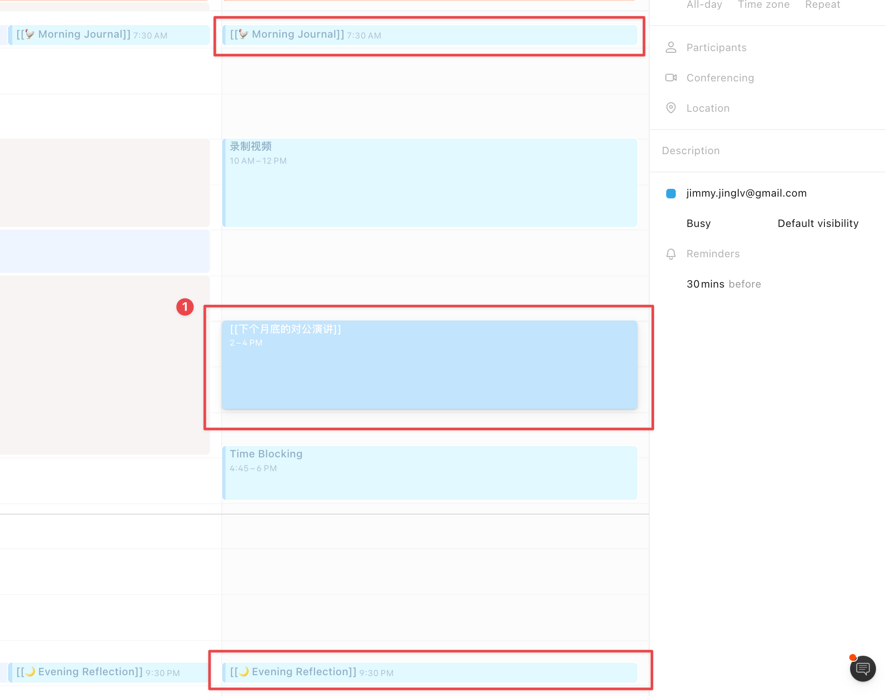

# ch1 写下来：从每日笔记开始，Roam 如何让你坚持「写下来」

你好，我是立青。欢迎和我一起探索《Roam Research 生产力实践》。那么第一讲，我想先跟你聊聊「写下来」，如何从每日笔记开始写下来，通过「间歇日记」的方式让你坚持记笔记。

## 一、从来就没有人完全从零开始

众所周知，现在笔记软件这个领域实在太卷了。在[《打造第二大脑》](https://www.buildingasecondbrain.com/)作者 Tiago Forte 的最新视频中介绍了整整 68 款笔记软件，这还不包括国产的很多软件。我在[「效率成瘾」年度征文](https://sspai.com/post/71518)中也跟你讲过，大家在用笔记软件的时候好像都是在玩具，而不是真正去使用它。所以，第一篇文章我就想给你讲一下如何从方法论的角度去使用这些工具。

### 1.1 打造一个系统，帮助自己「尽快地」开始产出

市面上这么多笔记软件，它们互相混战，最后谁能胜出倒也无所谓。而作为我们这样的使用者，作为笔记用户，当然我们还是更关心自己的产出。

就拿我自己来说，经常需要做视频、写文章、做课程乃至写代码、做产品，其实最难的部分就是「如何开始」，真的可以说只要你开始了就已经胜利了 50%。

所以，**你需要打造一个系统，来帮助自己能够尽快地开始**，而不用在创作的时候面对一张白纸，或者是空白的 Word，能够运用自己的积累快速产出自己想要创作的作品。

那么，如何开始积累属于自己的知识，怎么样有效地提取信息呢？在这个早就知识过剩的时代，从来就没有信息过载，而只有你的过滤失败。

我对于这个问题的答案就是，使用 Daily Note 来帮助自己「写下来」。因为只有「写下来」才能开始积累。

> "不写，就无法思考。"（卢曼 1992,53） —— [《卡片笔记写作法》](https://book.douban.com/subject/35503571/)

### 1.2 重要的事情从来都不紧急，却需要兼顾？

让我们来假设一下，**如果你每天都很忙，下个月底还要做一个「对外演讲」的项目**，你可能会每天非常地焦虑，完全腾不出时间去做「对外演讲」这件真正重要的事情，该怎么破局呢？

也许我们每个人都会有类似的情况，想要兼顾到工作、生活、学习等等各个方面，所以每天都会匆忙面对很多**紧急**的事情。但与此同时，也有一些非常**重要**的项目，比如说「对外演讲」或者是写 PPT、完成博士的论文等等，这样的主要项目更需要推进。

但往往因为自己腾不出时间就一直在拖延，用其他的一些刷剧、看电影等方式来消磨自己的焦虑。而此时，由于没有去真正推进「对外演讲」这个项目，自己反而又变得更加焦虑了。

所以，为什么你迟迟没有开始？其实是因为你直接面对的是一张白纸，来准备几个对外演讲，面对一个空 Word 或者是 PPT 去思考，你到底应该讲什么内容。

与此同时，生活上，你可能还需要去给孩子找学校，或者是马上要暑假了，准备带孩子或者是老婆出去玩，你需要做一个旅行计划；学习上，你还有很多播客还没来得及看，还有很多书想读，包括很多有趣的视频也还没来得及看。

该怎么办呢？面对这样一张白纸，你应该怎么去准备自己的项目呢？

## 二、认识 Roam Research 中的 Daily Notes

Roam Research 里面的 Daily Note 是我们所能接触到的第一个功能，为什么我觉得它非常有用，是因为它能够帮助你坚持「写下去」，不管是写什么。


从来就没有人会从一张白纸开始，你不需要，也不可能完全从一张白纸或者是空白的屏幕开始写作，这是彻头彻尾的误解。

在《卡片笔记写作法》中提到，我们不可能从零开始把论文写作拆成很多个步骤，开始逐一地展开，而是在平常我们就需要去做积累，把看到的内容转成一张张卡片。而且，在寻找解决方案的同时，它并不是线性的过程，而是循环的「非线性」的过程。**那么这个非线性的过程就散落在我们每天的日常里面。**

我们怎么把它收集在一起，形成针对于具体项目的脉路呢？

### 2.1 写作并不可怕，可怕的是面对一张白纸

以「对外演讲」这个重要项目为例，如果说你已经记录了 30 天时间的 Daily Notes，写下了你的思考和收集的信息，那么 30 天之后，等待你的就不再是一张白纸。

一般来说，你只需要找到一个安静的地方，戴上耳机，用番茄钟计时，打开 Roam Research 快速生成一套模板，就可以开始写作。这完全可以称之为填空式写作，因为你需要写的内容已经准备好，接下来就只需要在每个子标题下面，把你收集的内容有序填空即可。

那么，你如何在平日里就去做积累呢？在 Roam Research 里面，答案就是 Daily Notes。每日笔记这个习惯怎么夸大都不足为奇。毫不夸张地说，如果说没有 Daily Notes 的记录，我就没有办法去创作任何内容。

每天都是崭新的一天，Daily Note 也可以是崭新的一张白纸，在每天面对 Daily Notes 的时候，你可以不停地去写“我在干什么、写什么，在想什么和读了什么，以及看到别人说了什么”，尽情倾倒自己脑海中的想法。

因为只有当你真正去写下来，才可以让我们的想法呈现在纸上，才可以去基于纸上来思考。人的大脑思维没有那么大的工作记忆容量，所以需要外部的辅助工具，来帮助你自由地、发散地、无止境地去探索自己的想法。

### 2.2 「写下来」，就是 Daily Notes 的意义

「写下来」本身就是 Daily Note 每日笔记的意义，哪怕你没有回去看这些日记，时间并没有被浪费掉，因为写的这个过程在帮助你思考 —— 写的过程就是你思考的过程。

总之，Daily Note 可以帮助你去积累每天所看到的、学到的和思考的内容。写作并不是从一张白纸开始，我们需要建立一套日常的写作笔记工作流，通过写笔记来思考，让记下来的笔记可以成为之后写文章、做项目的基础。

另一方面，为什么我选择在 Roam Research 里面来做这件事情，而不是使用印象笔记或者是 Obsidian。因为 Roam Research 对于 Daily Note 的设计和思考是非常好的，好的工具是自带方法论的。

Daily Note 这个设计虽然不新鲜，但是也是随着 Roam Research 的兴起才被其他很多软件借鉴，可以说它是结合了时间维度的笔记工具。好的工具并不只是为你增加更多的功能，而是帮助你减少对主要工作的干扰。

打开 Roam Research，你首先面对的就是 Daily Note 这样一张白纸， 你可以开始写下自己的任意的想法。在这个时候你根本就不需要知道什么是双向链接，也不需要知道 Roam Research 其它的一些功能。

你就把 Roam Research 当成一张张这样的白纸，帮助你去思考，尽可能减少页面跳转、鼠标移动、材料引用、动画刷新等工具的行为，避免对大脑的思考造成干扰。

作为一名程序员，我的描述就是一种「在写代码的时候手指不离开键盘」的爽快感。我的思考没有任何干扰，但能创造无限的结构，结合我在使用的 Vim 模式快捷键，可以任意打开我想查看的内容。

所以说，只要哪个软件能够让你坚持「写下去」，它就是最棒的！不知不觉，Roam Research 让我坚持写了两年多的 Daily Notes，我是如何做到的呢？

## 三、间歇日记：时间戳 + 感谢 + 下一步行动

在多年的实践过后，我想推荐给你的方案是 —— 使用「间歇日记」的方式来写我们的每天的 Daily Notes。

我在每天的日记下面，都写了很多带时间戳的一句话内容，时间戳 + 感谢 + 下一步行动这三大要素，形成了缺一不可的标准格式。


### 3.1 感性认识：「间歇日记」的具体示例

截图的左侧有几个例子，而右侧 Sidebar 可以查看「感谢」关键词在 Roam Research 中引用出处，里面记录的都是我的「间歇日记」：时间戳 + 感谢 + 分号（；）后面的下一步行动。比方说，

- 感谢同事：`23:20 感谢@Jordan提前为2022 T2 Product Squad Formation会议做的准备；下面我就要开始看一下notion policy、action meeting 和 loom video`

- 感谢老婆：`17:23 感谢老婆买了咖啡；婚礼歌单、预约体检、天猫养车`
- 感谢朋友：`21:49 感谢永锡老师的每日计划截图； {{[[DONE]]}} 我之前做的styled-roam日历视图其实就可以显示为 模糊的 Time Blocking with Blocks`
- 感谢少数派：`08:48 感谢sspai推荐了一篇折腾M1 Mac安装Windows系统的文章，果然是少数派，刚好满足了我的需求；就目前而言，我还没确定要买[购买 Parallels Desktop for Mac]，所以决定先使用 Macwk 试用版先感受一下，再说了， 我也没那么多时间玩游戏呀😂`
- 感谢自己：`23:20 感谢今天的感恩日记，至少没有过得很糟糕； 而且还在自己的掌控之中`

可以看到，虽然有些记录比较粗糙，但「间歇日记」基本上起到了承上启下的作用。甚至我还有很多情绪上的记录，比如说「感谢今天的感恩日记」，因为我在晚上的时候会有一个例行的 Routine 去回忆今天的一天，发现自己今天其实没有过得那么糟糕，觉得生活还是在自己的掌控之中的。

```
17:58 感谢今天的记录，感恩日记让我在心态上有不少的变化，面对现实，活在实现中。
```

说真的，翻到自己关于感恩日记的一些记录也会产生新的灵感。哪怕今天没有写任何的感恩日记，我也突然意识到这些**感恩日记可以给我带来一种「回甘」的快乐**。在回忆的时候能够像喝茶一样。它虽然最开始有苦味，但是你慢慢去品的话，会有一种甘甜的味道。

**间歇日记，你可以写在 Daily Note 的任何地方，也可以写在推进项目过程中的任意地方**。比如说看到了一篇好的文章，在文章下面做笔记的时候，你也可以做感谢 —— 因为很这篇文章里面的作者帮助到自己解决正在困扰的问题。比如说很多时候遇到 bug 去找各种资料，发现由于作者的方案解决了当前的几个问题。

### 3.2 「间歇日记」可以理解为「晨间日记」的扩充版

当然，聪明的你肯定也听说过「晨间日记」等其他的一些日记形式。其实我对于「间歇日记」的理解在于，它不只是在早晨，而是在每个时间的间隙，我都可以去做一次感恩的环节，并且为自己下一步行动做一定的准备。

在我的早晨，只要我一打开 Daily Note 就会开始倾倒大脑中的想法，这个时候的「间歇日记」不就是「晨间日记」嘛？当然，我的晨间日记流程也有一些模板和方法，我会在接下来的文章中再做介绍。

- 在不期而得中练习感恩。
- 在理所当然中练习感恩。
- 在困难挫折中也要练习感恩。

总之，你可以理解为「间歇日记」就是「晨间日记」的扩充版，在一整天的每个间隙，都穿插了这个感恩 + 下一步计划的形式。当你在每天的 Daily Note 里面都能够去记录自己的想法，在一次次记录之后去推进自己手头的项目。哪怕是在每天都很忙的情况下，无论是细碎小事，或者是有时间截止日期的对外项目，你都可以通过下一步行动来推进它，重新找到掌控感。

甚至，还会变得更加幸福一点点，🤏。你相信吗？

## 四、「间歇日记」最佳实践，我的 Roam Research 每日 Routines

好，我相信你对「间歇日记」已经有了一个感性的认识，对于我来说，我觉得「间歇日记」是时间维度上的笔记陪伴。接下来，我来带你仔细「回甘」一下，间歇日记结合 Roam Research 的每一步具体实践。

我会分为三个部分来讲，Daily Note、时间戳和 Routine 模板，随便介绍 Roam Research 的功能。

### 4.1 间歇日记的灵感来源 Interstitial Journaling

首先我们来看一下间歇日记的灵感来源，追本溯源能够帮助你更好地实践和运用它。

「间歇日记」的英文名为 Interstitial Journaling，是由 Tony 老师（[Coach Tony](https://betterhumans.pub/replace-your-to-do-list-with-interstitial-journaling-to-increase-productivity-4e43109d15ef)）最开始在 2017 年写的这篇 [Replace Your To-Do List With Interstitial Journaling To Increase Productivity](https://betterhumans.pub/replace-your-to-do-list-with-interstitial-journaling-to-increase-productivity-4e43109d15ef) 文章中所介绍的。

Tony 老师当时也跟你一样，在使用「番茄工作法」—— 专注 25 分钟，休息 5 分钟。那么，休息的这 5 分钟，它是你的奖励，你可以去毫无愧疚地上网、看手机或者吃东西或者休息等等。

但是，至少对于我自己的实践来说，我往往就会因为这个休息时间而过度休息了。比如说玩手机看到好玩的或者是回复别人的消息时，就陷入了另外一个兔子洞。

Tony 老师就在思考，如果我们能够利用这五分钟，去做更有意义的事情会怎么样呢？

所以他就把「晨间日记」和「番茄工作法」的休息时段结合起来了，通过「间歇日记」的方式来开展自己的每日记录。文章中也有一段示例，

```
上午9:37。
给 Nik 写完了关于为我们再写一篇文章的电子邮件。我可能不需要再跟进了。另外，我的一部分头脑还在想，我是否应该向他建议一个主题。
现在，切换到写文章。我的下一个行动是什么？哦。就打开Medium。一旦我把介绍写好了，文章就会很流畅。我应该为必须重写几十次的介绍而锻炼自己。
```

1. 时间戳：上午 9:37
2. 他完成了什么？完成了给 Nik 的电子邮件，建议再写另外一篇文章。
3. 他的下一步行动是什么？打开 Medium 把介绍写好，文章怎么怎么样，必须写几十次的介绍锻炼自己。

其实这整个过程也相当于给自己打气，帮助自己进入到下一个工作项目，也就是进入到「下一个番茄」🍅 要做的事情。当然，很重要的是休息这五分钟有所安放，不会再破坏自己的链条。

> 想要成为优秀的喜剧演员，就要每天都写笑话，才能创作出更好的笑话。保持每天都写笑话的链条，下一步就是让链条不要断掉。 —— 《深度工作》

### 4.2 「间歇日记」穿插于你的每日 Routines

接下来，我会跟你分享如何通过 Roam Research 的模板功能和日历插件，来辅助我快速记录间歇日记。当然还包括，在一天结束时如何回顾，以及如何转写所记录下的卡片笔记。

首先，最简单的是每天早上打开新的当日笔记，第一件事情去记录开始工作的时间，你可以通过斜杠 `/current time` + 回车快速插入当前的这个时间，再按空格就可以记录下自己的第一个想法，就这么简单。


按照我所推荐的标准格式，我先写「感谢」，`12:32 [[感谢]]自己开始录制视频`，然后通过`；`分号来区分「下一步行动」，`接下来放大演示区域，后面在剪辑的时候就观感更好啦`。

另外，我每天早上会在日历上，提前为工作时间段安排一些工作，而在晚上的时候也会有 Reflection 反思的过程。

1. 晨间日记 🐓 Morning Journal
2. 日程安排 `[[roam/js/google-calendar]]`
3. 夜间反思 🌙 Evening Reflection

可想而知，在这些时间段的间隙中，我们也还可以插入更多的「间歇日记」。那么，在这三个 Routines 中间的时间段，我会可以借助一些 `roam/templates` 模板，来帮助我快速输入这些 routine 例行事项。

### 4.3 搭建 Roam Research 模板，复用输入模式

让我们一起来搭建一下。首先是 `[[🐓 Morning Journal]]`，在 Roam Research 里面，你可以使用 `roam/templates` 模板，也就是斜杠 `/template` 输入快速新建一个模板。


进入到 `roam/templates` 模板页面，第一层级的 Block 内容就是模板的标题，比如说你可以新建一条叫做 `[[🐓 Morning Journal]]`，然后在缩进的子 Blocks 中可以放下一些内容。

通常来说我会手动加上时间戳 `/current`（先不按下回车），然后输入自己的一些想法，比如说我会输入 `[[感谢]]`，再加分号`；`写下自己的下一步行动，举个例子`接下来我会花 15 分钟完成GIF录制`。

当然，在这里你还可以借助 Roam Research 的 `/` 斜杠功能，添加字数统计和番茄倒计时。从而在你记录这些内容的时候，这里也会有个字数统计，以及花了多少时间，15 分钟倒计时还有多少分钟。


对于 `[[🐓 Morning Journal]]` 来说，我有一个自己在用的模板，即：

- `[[What's on my mind?]]` 什么是在我的脑海里的想法吗？
- `[[[[Make Time]] for today's Highlight?]]` 我如何安排时间给自己今天的 Highlight？

> 如果我度过的每一天，都会有一个高光时刻的话，对于今天来说，我会希望是什么？

### 4.4 在 Daily Notes 快速使用模板，建立习惯

所以，有了这样的 `roam/templates` 模板，我就可以回到每天的 Daily Notes，愉快地去使用模板快速插入内容了。


比如说，你现在直接回到今天的 Daily Notes，输入两个分号`;;`，你发现这里就会有个 `[[🐓 Morning Journal]]` 的模板标题，按下回车，你发现它自动插入了模板中的内容。

只是说这里的时间戳，还需要你在 `/current` 后面再按下一次空格+回车，它就直接变成具体的时间戳了。而在后面的教程中，我会为你介绍 `roam/js/smartblock` ，使用「动态块」可以自动帮助我们插入时间变量的具体值。

现在，我们就只需要专注当下的内容，开启番茄时间，开始倒计时，记录下自己的想法。


特别需要注意的是，当我回到 Daily Note 之后，你会发现在 当天日期 `[[June 4th, 2022]]` 页面下方，还会有一个「双向链接」的效果，显示得恰到好处。


这是因为我在今天的 Highlight 下方`[[下个月底对公的演讲]]` 的后边儿加上了一个 当天的日期 `/today`。

### 4.5 集成外部日历，安排专注时间块 Time Blocking

第二个跟你分享的示例是，我会使用 Google Calendar 插件来帮助我快速插入当天的日程，这里是通过 `roam/js` 来实现的（在本篇文章中我们先不做展开，后续会有专门的一章节来介绍如何在 Roam Research 使用 JavaScript。）这里我只是给你稍微演示一下，以彰显它的自动化能力，当然目前你可以先自己手动进行输入，成本也很低啦。


比如说我按下 `jj` 触发 SmartBlocks，然后输入 Google Calendar 进行搜索、选中按下回车，它就会开始加载我今天已经在日历里面安排的事项。



其实我还有一个很讨巧的办法，我在自己的日历上已经安排了 `[[🐓 Morning Journal]]` 和 `[[🌙 Evening Reflection]]` 的标题，而中间的时间段，我会提前通过 Time Blocking 的方式先把时间块全部都占好。

```shell
07:30 - 08:00 [[🐓 Morning Journal]]
10:00 - 12:00 录制视频
14:00 - 16:00 [[下个月底的对公演讲]]
16:26 [[感谢]]自己注意休息；下一步要开始剪辑视频啦！
16:45 - 18:00 剪辑视频 Time Blocking
21:30 - 22:00 [[🌙 Evening Reflection]]
```

特别重要的是，在前文中所演示的“我今天的 Highlight 是什么？”这个问题，比如说这里的「对公演讲」，虽然你给自己安排了今天的 Highlight 高光时刻，但是这个时刻到底是什么时候，肯定是需要做提前安排的。只有这样，你才能 Make Time（《创造时间》）去推进你真正重要的项目。

比如说，我就把下午的时间就安排给了 `[[下个月底的对公演讲]]`。这样的话，当我重新回到每日笔记里面，Google Calendar 插件就可以把我当前的这个日程全部都列出来了。刚刚我通过双链符号加的日历标题也会显示在这里。


从而，我对自己当前这一天的脉路就有了一定的安排。而在做每一个具体的项目时，我可以具体地去分配更多的时间戳。比如说 `12:45 [[感谢]]自己开始录制视频了；下一步我会吃饭`。而真正到了「对公演讲」这个项目的专注时间块，我会去梳理一下跟项目的具体内容。

这个时候可以点击当前「间歇日记」Block 前面的小圆点，缩进焦点，从而能够更加专注于当前的项目，而在这样的每个时间段内或者是在不同项目中间的空闲时间，都可以记录更多的间歇日记，比如说 `16:26 [[感谢]]自己注意休息`等等。

这样的话，这一天的时间戳基本上按照 Time Blocking 的方式来组织的。在每一个时间间隙，我也会持续不断地去记录下自己的一些想法和内容。

有了这样的时间戳记录之后，我甚至都不需要用类似于 Toggl 这样的工具来做时间记录了，这些日记就已经帮我记录下我一天干了什么、读了什么、想了什么、思考了什么。

### 4.5 利用「间歇日记」回顾你的一天

当然，最后还会有 `[[🌙 Evening Reflection]]` 这个环节，它是一个最简单的模板啦，但是我觉得它非常有用！

```markdown
- [[🌙 Evening Reflection]] {{[[POMO]]: 25}} {{word-count}}
  - [[What am I grateful for?]]
    - {{[[query]]: {and: [[感谢]] [[today]]}}}
  - [[What could I have done better?]]
    - {{[[kanban]]}}
      - ## [[Well]]
      - ## [[Less Well]]
      - ## [[Puzzle]]
```

我会思考一下，我今天感谢什么以及我什么事情可以做得更好。而且，我还会用到 `{{query}} ` 功能，通过`[[感谢]]`关键词和 `/today` 也就是今天的日期，来把我所有写了`[[感谢]]`的地方都给它摘出来，方便查看自己在这一天当中所感谢的所有内容。

（这里仅做 `{{query}}` 功能的演示，后续会有专门的教程来详细讲解 query 查询的使用方法）


比如说这里，我就能看到我在前文提到的示例，`12:45 [[感谢]]自己录制视频，下一步就会去吃饭`，从而形成了一个完整的，每天的日程安排与记录。

那么对于晚上做反思的时候，我还会有一项叫做 `what could I have done better?` 什么我可以做得更好？我会去思考，比如说明天我要做哪些改进。

如果更直观一点，我还会使用 `{{kanban}}` 看板来进行，比如说我直接输入 `;;retro` 就可以通过 `roam/templates` 模板来快速插入一个看板视图，来回顾 Well 我今天哪些做得好的，Less Well 哪些可以改进的，以及产生了什么新的 Puzzle 问题。


与此同时，你还可以用「块引用」（block ref）的方式来快速输入内容，比如说前文提到的`((剪辑视频))`。当然这里也可以写一些没有解决的问题，或者是你做得没那么好的，再提出一些改进建议。这里可以加一个 `/tomorrow` 明天的日期，`明天我要用标准的方式来写间歇日记`。诸如此类。

（这里仅做 `{{kanban}}` 和 `(()) block ref` 功能的演示，后续会有专门的教程来详细讲解 kanban 看板和「块引用」的使用方法）

### 4.6 关注已完成而非未完成，给自己安一个“动力马达”

通过刚刚的详细演示，我跟你分享了，我是怎么通过早上和晚上的 Routine，以及中间时间段 Time Blocking 安排的日历事项，来穿插地去记我的间歇日记。

而且，通过 `roam/templates` 模板或 Smart Blocks 可以快速输入内容。特别值得一提的是，借助这些模板的能力，能够帮助自己养成习惯。

- `;;` 触发 `roam/templates` 模板（静态）
- `jj` 触发 `roam/js/smartblocks` 动态模板
- 快捷键，通过 [BetterTouchTool](https://folivora.ai/) 或 [Keyboard Maestro ](https://www.keyboardmaestro.com/) 设置对应的 Snippets
  - e.g. `14:38 [[感谢]]内容；下一步的事项。`

当你通过「间歇日记」记录了每一天之后，你会发现在**时间维度**上，可以在每一个时间间隙，留下自己对当前做的这件事情的思考。从而可以引出另一个角度，**空间维度**。你要去思考每一条笔记，对自己「对外演讲」的项目有没有帮助。

从这个角度上，要持续不断地去输出，减少自己的 WIP（Working In Progress），也就是推进自己的作品或者是项目能够真正完成（Done）。

当你一天做了这么多事情，还可以通过我做的 `styled-roam/calendar` 日历视图插件，来快速回顾横跨很多天的间歇日记，也就是带时间戳的笔记。


所有这些日记，都可以通过时间戳的方式显示在日历上，从而可以帮助你更好地去回顾所记下的笔记。

当你开始关注已完成的事情，而非未完成的 todo list 待办事项。那么这些已完成的事情对你的信心是有所帮助的。其实这也是现阶段，所有的任务管理工具的缺点，因为它们都是围绕「未完成」，这些未完成的 todo list 反而会给我们带来很大的压力。

但是在 Roam Research 记下的这些间歇日记，可以帮助我们知道：我今天成长得不错，我今天感谢了哪些事情以及我下一步要做什么。

所以说，做一件事情也是为了获取洞见，不只是把事情做完，而且间歇日记可以帮助我们更好地去回顾，每次做项目的整个「过程」，去发现不同事务之间的联系。

### 4.7 「间歇日记」还可以跟卡片盒笔记法相结合

那么在整个过程当中，我更重要的是希望在这些「间歇日记」的记录中，积累自己的知识。在后续的教程中，我会给你讲解怎么去再把自己今天的 Daily Note 转写成卡片盒里面的卡片，也就是 Zettelkasten 卡片盒笔记法的介绍。


你可以看到，Daily Notes 中带 `[[✱ 符号]]` 的内容都是我的卡片笔记，我每天会花一定的时间，把我在 Daily Note 里面记录下的「间歇日记」内容，根据其闪念笔记的价值，转成类似这样的卡片笔记。

而这些卡片笔记会放置到右边的卡片盒里面去，只要这样子持续不断地去积累，我们的卡片盒就会越来越丰富。而且这些卡片和卡片之间都会互相联系。每张卡片右侧的引用符号就是卡片的关联数量，代表着有多少张卡片链接了当前这张卡片。

所以，当你在写一张新卡片的时候，也要去跟自己之前的卡片盒进行交流，去发现不同卡片之间的联系。就像卢曼自己认为，他的作品的数量和广度都要归功于这不可思议的笔记系统：

> 当然，我不会将其全归功于我自己，还有相当一部分要归功于我的笔记系统.……本质上，这个系统解释了我的生产力……我花在它上面的时间多于写书的时间。

总结一下，「间歇日记」就是「写下来」的开始，你可以通过时间戳 + 感恩 + 下一步行动的方式，持续不断地推进自己的项目。并且，在这个过程当中，你会积累很多模板，通过模板来快速插入 Routine，从而辅助我们更好地去写日记，坚持「写下去」。

## 五、间歇日记的好处：1. 辅助思考 2. 积累知识 3. 修复情绪

### 5.1 间歇日记对比其他生产力方法

那么我们来做一个对比，「间歇日记」跟其他的自我管理的方法有什么不一样？

#### 1. 跟番茄工作法的关系 -> 休息

首先是「番茄工作法」，每设定 25 分钟的工作间隔，再休息 5 分钟，彼此交替的进行。当然这个工作间隙不一定是 25 分钟，你可以去找到属于自己的节奏。

番茄工作法最被人忽视的，非常关键的点在于 —— 休息跟专注的时间同等重要。

特别是休息这 5 分钟，我们该如何去利用它就变成了另外值得深度思考的问题。休息是你的奖励，你可以去玩手机或做任何的事情。但是，如果这 5 分钟你想要做更有意义的事情，那是可以跟「间歇日记」结合起来。

每过 25 分钟，你就可以通过快捷键的方式，快速输入时间戳，记录下把自己的当下的想法，去思考接下来二十五分钟该做些什么？

所以说，「间歇日记」可以跟番茄工作法结合起来，感谢过去的番茄，再思考下一个番茄做什么。

#### 2. 跟 GTD 的关系 -> 下一步行动

下一个是著名的时间管理理论 GTD， David Allen（大卫-艾伦）即 GTD 的发明者，他一直以来，推荐我们用「下一步行动」这个概念来辅助我们思考，让我们的待办清单能够真正地用起来。

因为我们往往会把任务当成项目，但是这个项目最首要的行动该是什么呢？只有当我们去思考项目的「下一步行动」，你才可以真正地开始这个项目。

比如说，你要去新疆旅游，需要做一个旅游项目的计划，第一件事情该做什么？当你去思考下一步行动的时候，第一件事情可能就是你要去 Google 一下，搜索一下新疆有哪些景点，再根据这些景点去安排下一个「下一步行动」，是选酒店或者是定机票、旅行社等等。

所以，「间歇日记」所定义的「下一步行动」，它一定是更小更细颗粒度的，可以推进当前你要做的项目的。如果说「下一步行动」会让你觉得，整个项目很复杂，你甚至对下一步该做什么没有头绪。那没关系，你可以用「第一行动」这个短语来替代他，至少，你的首要行动应该是先去 Google 搜索一下。

「第一行动」就是你，第一反应所能想到的可以做的事情。当你不知道你下一步要做什么的时候，你就可以检查自己的第一行动，去寻找解决问题的答案。

#### 3. 跟冥想的关系 -> “纸上冥想”

另外，我觉得「冥想」跟写日记是非常息息相关的。如果你之前已经记录过很多的日记，你会发现日记往往会给人真实且诚实的状态，诚实地面对自己。

把这些想法写进你的日记，可以让自己的心暂时的安定下来。比如说，你现在哪怕是有情绪的，你也可以把自己的感觉转化成可以分析和解决的理性思考。

当你把自己的想法写下来的时候，你就能够更加理性地去对待它，这种感觉就叫正念。

在你工作的时候，写日记还可以帮助你，去了解更多的背景上下文、情绪或者技能。

在[《思考，快与慢》](https://book.douban.com/subject/10785583//)这本书里面，就讲到了人的大脑是有两种模式的，一种是理性且努力的模式，可以帮助我们更好地去应对生活。另外一种则是情绪化或者是行为习惯性的模式，也潜意识之下的一种模式，称之为快模式。

「快模式」实际上统治了我们的生活，可以说我们生活中 90% 的角色都是潜意识来决定的。所以，写日记，能够把我们理性的那一面带出来，可以触发我们理性的思维模式。从而你在面对自己写下的内容时，会变得更加理性，重新找到平衡。

所以，写「间歇日记」，我会将它描述成一种「纸上冥想」的感觉，我们在用纸和笔或者是在 Roam Research 通过「间歇日记」的方式记录下自己的想法，可以让自己更加专注于当下。

总结一下。

「间歇日记」跟番茄工作法的结合点就在于更加注重休息。在休息的那 5 分钟内可以去简要地记录自己的想法，通过感恩 + 下一步行动的方式承上启下。

而对于 GTD 来说，它所强调的「下一步行动」，可以让你把范围聚焦在“我接下来要做什么”，首要的行动是什么，第一行动是什么？

以及当你持续不断地这样去写间歇日记，它会让你找到了一种纸上冥想的正念的感觉，让你能够更加「活在当下」。

### 5.2 间歇日记的 3 个好处

「间歇日记」的好处，可以总结为以下三点：

1. 辅助思考：不写，就无法思考
2. 知识积累：从来就没有信息过载，只有失败的信息过滤
3. 情绪修复：建立你的防崩溃机制

#### 1. 辅助思考：不写，就无法思考

第一个好处，「间歇日记」能够辅助我们思考，因为不写，我们就无法思考。

> 「人们高估了独立思考的能力。 没有外部帮助，记忆、思维和推理都会受到限制... ...真正的力量来自于设计能够提高认知能力的外部辅助设备。」
>
> —— 唐·诺曼，全球最具影响力的设计师，《设计心理学》的作者，苹果的前用户体验架构师《Things That Make Us Smart 让我们变聪明的科技: 在机器时代捍卫人类属性》

而像 Roam Research 这样的思考工具，就能够帮助你更好地去思考，以及借助于「间歇日记」这样的方式，帮助我们承上启下地，回顾之前做过的事情，从做过的事情当中汲取力量，感谢曾经的自己或者别人，并且顺利地开展下一步行动。

#### 2. 知识积累：从来就没有信息过载，只有失败的信息过滤

第二个好处，则是知识积累。「从来就没有信息过载，只有失败的信息过滤」。

当你把这些信息都写下来的时候，你是在做信息过滤，而且你可以把时间作为天然的过滤器。

当你把一个观点，第一次记录到你的每日笔记里面，当时你会觉得它非常好。但这很可能因为这篇文章它是标题党，或者是你在 Google 匆忙搜索到的第一篇文章，看起来很有意义。

而当你记录下之后，对它进行更深入的思考的时候，或者是当一天结束之后，你去回顾自己的 Daily Notes 的时候，你会发现很多的信息，其实都没有当初你想象的那么重要了。

所以，这就是一个积累的过程，首先是帮助你更好地去筛选这些信息。其次，我会在回顾的时候去做卡片转写。而卡片转写的过程，会帮助你把零散的闪念笔记或者是读书时的摘要笔记，真正转化成自己的卡片。

从而随着每天的流逝，我们不再是过完一天就没有有任何的印象，而是不断地积累自己的卡片盒，让自己的卡片盒不断丰富起来。等到你下一次真正需要创作的时候，你就可以快速地根据自己已有的卡片，来进行组装从而高效产出。当然在后续教程的输出部分，我也会再做更多的视频或文章进行介绍。

#### 3. 情绪修复：建立你的防崩溃机制

第三个很重要的好处，属于「情绪价值」，「间歇日记」能够修复你的情绪。

情绪修复的重点在于建立防崩溃机制，这个防崩溃机制能够帮助你及时地回归正轨。就像我之前演示的这些 Routines 或者是 `roam/templates` 模板，就能够帮助你恢复成平衡的状态，一种标准的状态，从而更有尽心去做接下来的事情。

特别是在每个时间间隙，我们都能从感恩日记里面汲取力量。或者是我们每过一天，你都可以重新获得，一个崭新的 Daily Note 页面。

这个页面对于我们来说，就是崭新的一天，可以说是 Daily Note 让我自己意识到，每天都是崭新的一天，而这崭新的一天能够帮助我重新开始。

不管昨天做得有多烂，我今天面对的都是一张白纸，而这张白纸等待我去书写，写下新的内容篇章。

## 六、总结：间歇日记 Time & Thanks & Next

「间歇日记」的三个标准元素，可以总结成 Time & Thanks & Next，也就是首字母拼在一起 TTN：通过时间戳的方式记录下当下的时间，并且写下自己刚刚完成的事情是什么，需要感谢什么，感谢能够给予你力量，从而又能够拥有开启下一步行动的情绪。而下一步行动是什么，又能够帮助我们承上启下去开展新的工作。

### 6.1 TTN 天堂鸟，Daily Notes 天天念

为了方便记忆，我给你总结了一个口诀：

> “TTN 天堂鸟，Daily Notes 天天念。”

偶然间，我通过输入法自动打出来的 `ttn` 就变成了“天堂鸟”，还可以变成“天天念”。因为 Daily Notes 就是每日笔记，也就是每天念叨地给自己写下「间歇日记」。

从每日笔记开始，Roam Research 可以帮助你坚持不断地去「写下来」，而只有写下来才可以帮助自己进行思考。

而写 Daily Note 最好的方式就是「间歇日记」，能够帮助你思考，帮助你积累知识，也能够帮助你修复情绪。

所以，哪怕你每天都很忙，面对下个月月底的「对外演讲」项目，也一定不再那么恐惧，因为你在持续不断地积累，也在持续不断地推进你自己的项目。

### 6.2 你的专属「下一步行动」

最后的最后，你在看完这篇教程之后，也可以有属于自己的「下一步行动」，在你的 Daily Note 里面，写下你的第一条「间歇日记」。

```markdown
{{[[TODO]]}} 在 [[Daily Note]] 中，写下你的第一条[[间歇日记]]
```

你可以用 TTN 模式写下当前的时间戳，再感谢一下今天看到的这个教程（就太好了 ✌️），下一步行动写下自己的间歇日记。

好。那么如果你觉得这篇教程写得还不错的话，欢迎留下你的评论，也可以转发推荐给更多的朋友。

后面的内容更加精彩，敬请期待，拜拜。
